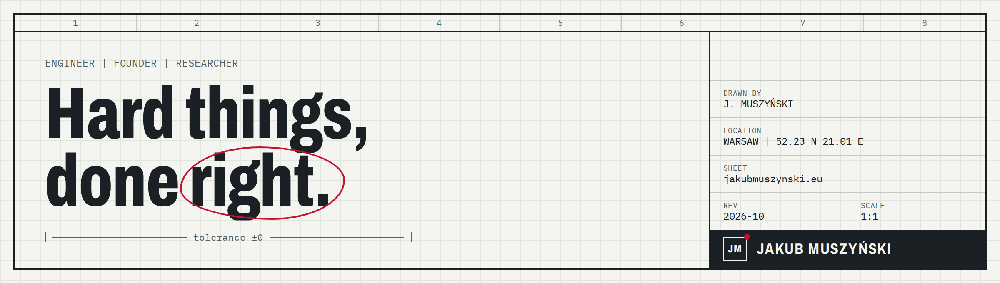

<a href="https://jakubmuszynski.eu">
  <picture>
    <source media="(prefers-color-scheme: dark)" srcset="assets/banner-dark.png">
    
  </picture>
</a>

I'm an engineer and founder in Warsaw. I like problems where almost right is the same as wrong: detector software at CERN, LLM inference at TSMC, risk systems at Point72, and two companies of my own. On the research side, I work on explaining what neural networks actually listen to.

[**Website**](https://jakubmuszynski.eu) | [**Writing**](https://jakubmuszynski.eu/writing/) | [LinkedIn](https://www.linkedin.com/in/jakub-muszyński-51133a273) | [ORCID](https://orcid.org/0009-0000-2797-6044) | [ACL Anthology](https://aclanthology.org/people/jakub-muszynski/)

### Now

- **Co-founder, CTO** at **EnergyScope**: edge telemetry hardware, load and PV forecasting, and battery dispatch for Polish factories.
- **Software Engineer, Risk Technology** at **Point72**.
- **M.Sc., individual studies** at **Warsaw University of Technology**: digital twins of real industrial sites, with explanations built into every decision.

Previously: production C++ for the **ALICE** experiment at **CERN** (2025–26), LLM inference at **TSMC** (2024), co-founder and CTO of **MedWave** (2024–25).

### Research

| | Paper | Code |
|---|---|---|
| **ACL 2026** | [mllm-shap: A Shapley Value Explainability Platform for Text-Audio Multimodal LLMs](https://aclanthology.org/2026.acl-demo.38/) | [MLLM-Shap](https://github.com/Pawlo77/MLLM-Shap) \| `pip install mllm-shap` |
| **BDA 2025** | [EnergyTwin: A Multi-Agent System for Simulating and Coordinating Energy Microgrids](https://link.springer.com/chapter/10.1007/978-3-032-23241-0_10) | [energy-twin](https://github.com/mvishiu11/energy-twin) |
| **MIDI 2025** | [An AI-Based Support Assistant for the ALICE-FIT Detector Setup at CERN](https://arxiv.org/abs/2511.17154) | |
| **arXiv 2026** | [SGPA: Spectrogram-Guided Phonetic Alignment for Feasible Shapley Values](https://arxiv.org/abs/2603.02250) | |

### Built from first principles

| | Project | What it is |
|---|---|---|
| **Languages** | [rustylox](https://github.com/mvishiu11/rustylox) | Tree-walking interpreter for Lox in Rust, compiled to WebAssembly. [Playground](https://mvishiu11.github.io/rustylox-playground/) |
| | [CoreLox](https://github.com/mvishiu11/CoreLox) | The same language again as a bytecode VM in C, with `switch`, `break` and `continue`. [Playground](https://lox-playground-pi.vercel.app/) |
| | [grep](https://github.com/mvishiu11/grep) | `grep` with a hand-written regex engine, in C++. |
| **GPU** | [hamming-one](https://github.com/mvishiu11/hamming-one) | Finds pairs of binary strings at Hamming distance one, massively parallel in CUDA. |
| | [electrostatic-simulation](https://github.com/mvishiu11/electrostatic-simulation) | Real-time 2D electrostatic field simulation in CUDA, 30+ FPS. |
| | [kmeans-clustering](https://github.com/mvishiu11/kmeans-clustering) | K-means on GPU and CPU, with templated kernels for compile-time loop unrolling. |
| | [CUDA-NPP-EdgeDetection](https://github.com/mvishiu11/CUDA-NPP-EdgeDetection) | Edge detection with a custom Sobel kernel against NVIDIA NPP. |
| **ML** | [torchlet](https://github.com/mvishiu11/torchlet) | Autograd library in the spirit of micrograd, with Cython extensions. |
| | [KANwise](https://github.com/mvishiu11/KANwise) | Kolmogorov–Arnold Networks in PyTorch with a Keras-like API. |

### Toolbox

Working on something hard? Write to jakub.m.muszynski@gmail.com.
